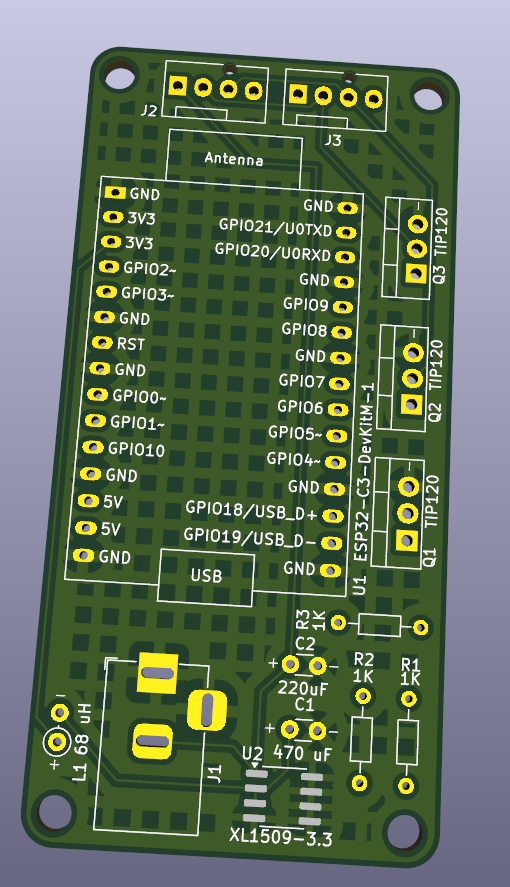

# LED Strip Controller 

This repository contains source files for an ESP32-based LED strip controller. The PCB is designed in KiCad, and the schematics and PCB layout can be found under `hardware`. Software will become available under `software` once I've written it.

## Hardware
### Requirements

- KiCad 
- [Espressif KiCad libraries](https://github.com/espressif/kicad-libraries) (required to resolve the ESP32 symbols/footprints used in the schematic and PCB)

### Components
|Name|AliExpress link|
|----|---------------|
|ESP32-C3-DevKitM-1|[https://aliexpress.com/item/1005009148596443.html](https://aliexpress.com/item/1005009148596443.html)|
|XL1509-3.3|[https://aliexpress.com/item/1005009637375630.html](https://aliexpress.com/item/1005009637375630.html)|
|TIP120 Transistors (3x)|[https://aliexpress.com/item/1005008609164136.html](https://aliexpress.com/item/1005008609164136.html)|
|1K Resistor (3x)||
|220uF Capacitor||
|470uF Capacitor||
|68uH inductor||
|Pin headers (male)||
|Barrel Jack Connector|[https://aliexpress.com/item/4001206395694.html](https://aliexpress.com/item/4001206395694.html)|

